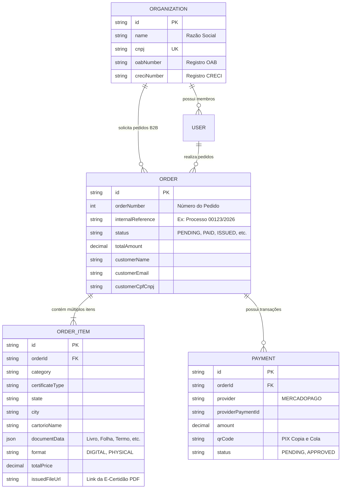

# 🏛️ Cartori - Documento Oficial de Arquitetura & Plano Diretor do MVP

Este documento define a arquitetura técnica, modelo de dados, integrações de APIs e roadmap do **Cartori**, uma plataforma **SaaS B2B & B2C** para emissão centralizada de certidões cartoriais e registrais em todo o Brasil.

---

## 1. 🎯 Visão do Produto & Proposta de Valor

### O Problema:
* No Brasil, cartórios são fragmentados por comarcas, circunscrições e atribuições (Registro Civil, Registro de Imóveis, Notas, Protesto).
* Advogados (inventários, divórcios, ações cíveis) e Imobiliárias (due diligence, compra e venda) perdem horas solicitando documentos em múltiplos sites diferentes, pagando taxas dispersas e gerenciando múltiplos prazos.

### A Solução **Cartori**:
* **Carrinho Multi-Item Notarial:** O cliente pode solicitar em um único pedido uma *Certidão de Nascimento em SP*, uma *Matrícula de Imóvel no RJ* e uma *Negativa de Testamento*, recebendo uma **única fatura/cobrança consolidada**.
* **Foco B2B (Advogados e Imobiliárias):**
  * Possibilidade de etiquetar cada certidão com o **Número do Processo Judicial**, **Código do Imóvel** ou **Nome do Cliente** para prestação de contas.
  * Repositório central de downloads com todos os documentos emitidos e assinados digitalmente (ICP-Brasil).
* **Processamento de Pagamento Oficial:** Exclusivo via **Mercado Pago** (PIX dinâmico instantâneo, Cartão de Crédito e Boleto).

---

## 2. 🏗️ Arquitetura Técnica & Stack Oficial

| Camada | Tecnologia | Justificativa |
| :--- | :--- | :--- |
| **Framework Fullstack** | **Next.js 14 (App Router)** | Performance SSR/SSG, rotas de API integradas e SEO otimizado. |
| **Linguagem** | **TypeScript 5** | Tipagem estrita de contratos de dados e schemas de formulários. |
| **Estilização & UI** | **Tailwind CSS + Lucide Icons + Framer Motion** | Design profissional, responsivo e paleta Notarial (Navy Blue & Gold). |
| **Banco de Dados & ORM** | **PostgreSQL (Supabase / Neon) + Prisma ORM** | Modelagem relacional robusta com suporte a B2B, Organizações e Pedidos Multi-Item. |
| **Autenticação** | **Supabase Auth** | Autenticação segura por e-mail/senha e tokens JWT. |
| **Gateway de Pagamento** | **Mercado Pago SDK Oficial (`mercadopago`)** | Pagamento via PIX instantâneo (QR Code + Copia e Cola), Cartão e Webhooks. |
| **Porta de Desenvolvimento Local** | **`3006`** | Totalmente isolada para prevenir conflitos de rede locais. |

---

## 3. 🌐 Integrações de APIs Externas

```
                     ┌────────────────────────────────────────────────────────┐
                     │                     CARTORI BACKEND                    │
                     └──────────────────────────┬─────────────────────────────┘
                                                │
           ┌─────────────────────┬──────────────┴──────────────┬─────────────────────┐
           ▼                     ▼                             ▼                     ▼
 📍 [API IBGE Localidades] 🏢 [Base de Cartórios]   📬 [API ViaCEP]       💳 [Mercado Pago SDK]
 • Estados (/estados)     • Serventias por Comarca  • Consulta de CEP     • PIX QR Code Dinâmico
 • Municípios por UF      • CNS / Atribuições       • Auto-preenchimento  • Webhook de Status
```

### 1. 📍 API do IBGE (Estados e Municípios)
* **Endpoint Estados:** `https://servicodados.ibge.gov.br/api/v1/localidades/estados?orderBy=nome`
* **Endpoint Municípios:** `https://servicodados.ibge.gov.br/api/v1/localidades/estados/{UF}/municipios?orderBy=nome`
* **Implementação Local:** [`src/lib/ibge.ts`](file:///I:/Modesto%20Pessoal/cartori/src/lib/ibge.ts) com cache em memória e revalidação de 24h.
* **Rotas de API:**
  * `GET /api/locations/states`
  * `GET /api/locations/cities?uf=SP`

### 2. 🏢 Base de Cartórios e Serventias (CNJ / Justiça Aberta)
* Identifica os cartórios da comarca conforme o tipo de certidão (Registro Civil, Imóveis, Notas, Protesto).
* **Implementação Local:** [`src/lib/cartorios.ts`](file:///I:/Modesto%20Pessoal/cartori/src/lib/cartorios.ts).
* **Rota de API:** `GET /api/cartorios?uf=SP&city=Campinas&category=registro-civil`
* Suporta a opção *"Não sei o cartório / Solicitar busca especializada"*.

### 3. 📬 API ViaCEP (Endereço & Frete)
* Consulta instantânea de CEP para pedidos com envio de certidões físicas via Correios/Sedex.
* **Implementação Local:** [`src/lib/viacep.ts`](file:///I:/Modesto%20Pessoal/cartori/src/lib/viacep.ts).
* **Rota de API:** `GET /api/cep/01001000`

### 4. 💳 Mercado Pago (Gateway de Pagamentos)
* **Implementação Local:** [`src/lib/mercadopago.ts`](file:///I:/Modesto%20Pessoal/cartori/src/lib/mercadopago.ts).
* **Rotas de API:**
  * `POST /api/payments/mercadopago` -> Cria cobrança PIX com QR Code Base64 e Copia e Cola.
  * `POST /api/payments/webhook` -> Recebe notificação em tempo real de aprovação de pagamento.

---

## 4. 📑 Categorias de Certidões do MVP

| Categoria | Certidão | Prazo Estimado | Formato |
| :--- | :--- | :---: | :---: |
| **Registro Civil** | Certidão de Nascimento | 3 a 5 dias | Digital / Físico |
| **Registro Civil** | Certidão de Casamento | 3 a 5 dias | Digital / Físico |
| **Registro Civil** | Certidão de Óbito | 3 a 5 dias | Digital / Físico |
| **Tabelionato de Notas** | Negativa de Testamento (CENSEC) | 1 a 3 dias | Digital / Físico |
| **Tabelionato de Notas** | Certidão de Escritura Pública | 3 a 6 dias | Digital / Físico |
| **Registro de Imóveis** | Matrícula de Imóvel (com Ônus) | 2 a 4 dias | Digital / Físico |
| **Tabelionato de Protesto** | Certidão de Protesto (5/10 anos) | 1 a 3 dias | Digital / Físico |

---

## 5. 🗄️ Modelo de Dados (Prisma Schema)

O schema está implementado em [`prisma/schema.prisma`](file:///I:/Modesto%20Pessoal/cartori/prisma/schema.prisma):



---

## 6. 🗺️ Roadmap de Execução

- [x] **Fase 1: Setup da Base & Limpeza do Repositório** (Porta 3006, Next.js 14, TypeScript, TailwindCSS).
- [x] **Fase 2: Serviços & Integrações de APIs** (IBGE Estados/Cidades, Cartórios, ViaCEP, Mercado Pago SDK).
- [x] **Fase 3: Documento de Arquitetura & Plano Diretor** (`docs/ARCHITECTURE_AND_MVP_PLAN.md`).
- [ ] **Fase 4: Motor de Checkout Dinâmico Multi-Itens** (Formulários reativos por certidão, carrinho persistente, seletor de adicionais e frete).
- [ ] **Fase 5: Autenticação & Painel B2B do Advogado/Imobiliária** (Gestão de pedidos por processo, histórico e download de e-certidões).
- [ ] **Fase 6: Gateway Mercado Pago em Produção & Testes E2E**.
